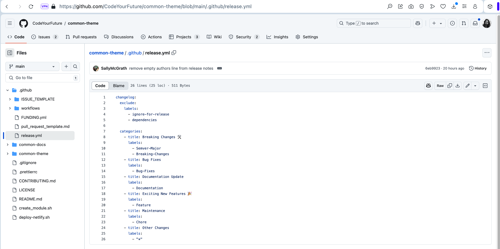
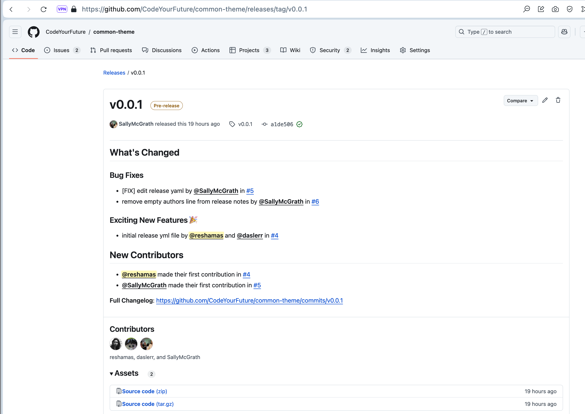
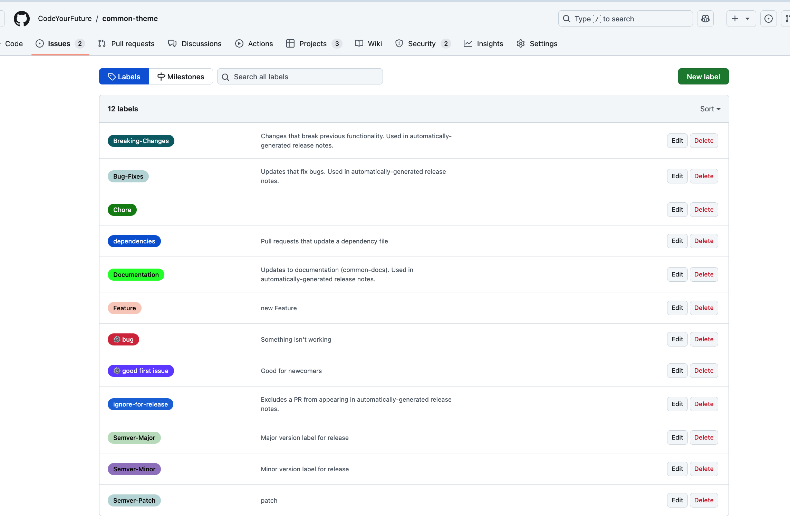

# Common Theme Release workflow

## Release Notes
- We are using the following versions specs (in lieu of [Semantic Versioning specs](https://semver.org/))
    - Major release (`Semver-Major`): rare (Example: paradigm change)
    - Minor release (`Semver-Minor`): monthly (Example: breaking changes, documentation, fixes)
    - Patch release (`Semver-Patch`): as and when (Example: small features)
- Dependencies
    - are ignored in release documentation
- New contributors
    - are automatically listed in the release notes
- New categories in the release notes
    - (1) can be created by adding a label to the repo
    - (2) update [release.yml](.github/release.yml) file with [labels](https://github.com/CodeYourFuture/common-theme/labels) in the appropriate category
- common-theme will follow the 2-cycle deprecation:
    - Version n: Introduce deprecation
    - Version n+1: Deprecation stays
    - Version n+2: Add breaking change removing deprecation
- Breaking changes
    - if the user cannot build their site when the only change made is updating the common-theme version
    - if the site will continue to build, but will start ignoring or mis-interpreting some input specified in the site


## Quick Links for [common-theme](https://github.com/CodeYourFuture/common-theme) repo
- Release file specifications: [`release.yml`](.github/release.yml) 
- Example: [Release Notes](https://github.com/CodeYourFuture/common-theme/releases/tag/v0.0.1) (automatically generated by GitHub)
- Example: [Change log](https://github.com/CodeYourFuture/common-theme/commits/v0.0.1) (automatically generated by GitHub)
- common-theme [Labels](https://github.com/CodeYourFuture/common-theme/labels)
- common-theme [Releases](https://github.com/CodeYourFuture/common-theme/releases)
- common-theme [Release Tags](https://github.com/CodeYourFuture/common-theme/tags)


## Pre-Release Checklist
- [ ] Ensure all pull requests to be included in the release are labeled and with the appropriate category (Ex: `Breaking-Changes`, `Bug-Fixes`, `Documentation`, `Feature` etc )
- [ ] Ensure all pull requests to be included in the release are labeled with the appropriate version category (Ex: `Semver-Major`, `Semver-Minor`, `Semver-Patch`)
- [ ] If a new label has been added ensure that the [release.yml](.github/release.yml) file has been updated
- [ ] Run a test build with the new release to ensure there are no major errors or bugs in the [common-theme](https://github.com/CodeYourFuture/common-theme) repo
- [ ] Run a test build with the new release to ensure there are no major errors or bugs in the [curriculum](https://github.com/CodeYourFuture/curriculum) repo
- [ ] Run a test build with the new release to ensure there are no major errors or bugs in other downstream consumers

## To Create a New Release

1. Go to [`Draft a New Release`](https://github.com/CodeYourFuture/common-theme/releases/new).
1. Go to `Choose a new tag`. Set the appropriate tag depending on whether it is a major / minor or micro/patch release.
1. Pick a branch or recent commit
1. `Release title`: Example: `Version 0.0.1`
1. `Release notes` automatic update: this section will be automatically populated after hitting `Publish release` and there will be an option to edit the release notes
1. `Release notes` manual updates: 
    - [ ] Add a line to the release notes to credit the release manager
    - [ ] List out, as concretely as possible, any steps users have to take when they upgrade beyond just bumping the dependency
    - [ ] Write pseudocode that highlights what code should change and how
    - [ ] Call out if it is recommended that users upgrade because of known problems with older releases

## References
* GitHub [Automatically generated release notes](https://docs.github.com/en/repositories/releasing-projects-on-github/automatically-generated-release-notes)
* Semver: [Semantic Versioning Specifications](https://semver.org/)
* Semver [specs disagreement and discussion](https://gist.github.com/jashkenas/cbd2b088e20279ae2c8e)
* PyMC [Release Checklist](https://github.com/pymc-devs/pymc/blob/main/docs/source/contributing/release_checklist.md) 
* scikit-learn [Release Process](https://scikit-learn.org/dev/developers/maintainer.html#releasing) 
* Example of [Feature Freeze](https://scikit-learn.org/dev/developers/maintainer.html#reference-steps)

## Examples
Note: These are *examples*. Release notes and `yml` files will be updated for releases.

- Note that repo label names should match exactly to its references in the `release.yml` file. For example the label `Breaking Changes` will not connect with `Breaking-Changes` in `release.yml`. (For example, the match is case sensitive and hyphens should match.)
- If a new label is added, ensure it is added to the appropriate category in the `release.yml` file.

#### [`release.yml`](.github/release.yml) file used for Release v0.0.1

```markdown
changelog:
  exclude:
    labels:
      - ignore-for-release
      - dependencies

  categories:
    - title: Breaking Changes 🛠
      labels:
        - Semver-Major
        - Breaking-Changes
    - title: Bug Fixes
      labels:
        - Bug-Fixes
    - title: Documentation Update  
      labels:
        - Documentation
    - title: Exciting New Features 🎉
      labels:
        - Feature
    - title: Maintenance 
      labels: 
        - Chore
    - title: Other Changes
      labels:
        - "*"
```



#### [Release Notes for v0.0.1](https://github.com/CodeYourFuture/common-theme/releases/tag/v0.0.1)


#### common-theme [Labels](https://github.com/CodeYourFuture/common-theme/labels)

